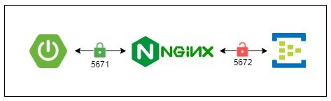

# Using Spring Cloud Azure with Event Hubs Emulator - Workaround

This code samples demonstrates how to use Event Hubs Emulator from Spring Cloud Azure.


>**Unfortunately, the Azure Event Hubs emulator cannot be used with Spring Azure Cloud 4.x/5.x at the moment, but there is a workaround.**

>**Problem**:
The emulator runs on the unsecured AMQP 5672 port. To interact with the emulator, you need to use a predefined connection string that includes the new parameter 'UseDevelopmentEmulator'.
> 
>This new parameter is utilized within the Azure SDK to establish a connection to the emulator over port 5672. Otherwise, the connection will default to the secured AMQP port 5671, requiring a certificate for authentication.
>
>Spring Azure Cloud versions 4.x/5.x depend on an SDK that does not support the new connection string parameter. This results in an 'Illegal connection string parameter name: UseDevelopmentEmulator' exception.
>
>You can attempt to use a newer version of the SDK dependency (azure-core-amqp 2.9.4), which does support the new parameter. However, be aware that it also contains a bug (https://github.com/Azure/azure-sdk-for-java/issues/40938) preventing the setup of an insecure connection to the emulator.

## Workaround

A workaround solution involves using a self-signed certificate and a reverse proxy with SSL termination in front of the emulator.



### Generate self signed certificate

When generating a certificate, enter `localhost` for the `Common Name` (`server FQDN`).

```shell
openssl req -x509 -nodes -days 365 -newkey rsa:2048 -keyout docker/volumes/ssl/nginx-selfsigned.key -out docker/volumes/ssl/nginx-selfsigned.crt
```

### Create keystore

You will supply this keystore as a JVM parameter, when running your application.

```shell
keytool -importcert -file docker/volumes/ssl/nginx-selfsigned.crt -keystore ./keystore.jks -alias "nginx-selfsigned" -storepass changeit
```

### Run Nginx container

```shell
docker compose -f docker/docker-compose-nginx.yml up -d
```

## Run samples

- [Communicate to a Single Event Hubs Namespace via Azure SDK for EventHubs](eventhubs-client/README.md)
- [Communicate to a Single Event Hubs Namespace via Spring Cloud Stream](eventhubs-binder/README.md)


Replace ABS_PATH with the absolute path to the generated keystor.jks file. (on Windows use `c:/path/to/keystore`)

Run with JVM arguments:
- `-Djavax.net.ssl.trustStore=ABS_PATH/keystore.jks`
- `-Djavax.net.ssl.trustStorePassword=changeit`
- `-Djavax.net.ssl.trustStoreType=jks`

```shell
mvn clean -pl eventhubs-client spring-boot:run -Dspring-boot.run.jvmArguments="-Djavax.net.ssl.trustStore=ABS_PATH/keystore.jks -Djavax.net.ssl.trustStorePassword=changeit -Djavax.net.ssl.trustStoreType=jks"
```

```shell
mvn clean -pl eventhubs-binder spring-boot:run -Dspring-boot.run.jvmArguments="-Djavax.net.ssl.trustStore=ABS_PATH/keystore.jks -Djavax.net.ssl.trustStorePassword=changeit -Djavax.net.ssl.trustStoreType=jks"
```

## Resources:

- [Introducing Local Emulator for Azure Event Hubs](https://techcommunity.microsoft.com/t5/messaging-on-azure-blog/introducing-local-emulator-for-azure-event-hubs/ba-p/4146454)
- [Azure Event Hubs Emulator](https://mcr.microsoft.com/en-us/product/azure-messaging/eventhubs-emulator/about)
- [Overview of the Azure Event Hubs emulator](https://learn.microsoft.com/en-us/azure/event-hubs/overview-emulator)
- [Test locally by using the Azure Event Hubs emulator](https://learn.microsoft.com/en-us/azure/event-hubs/test-locally-with-event-hub-emulator)
